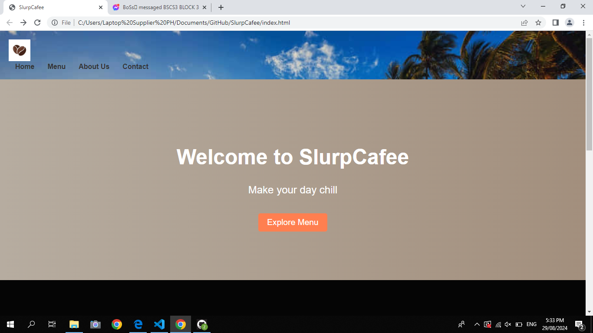
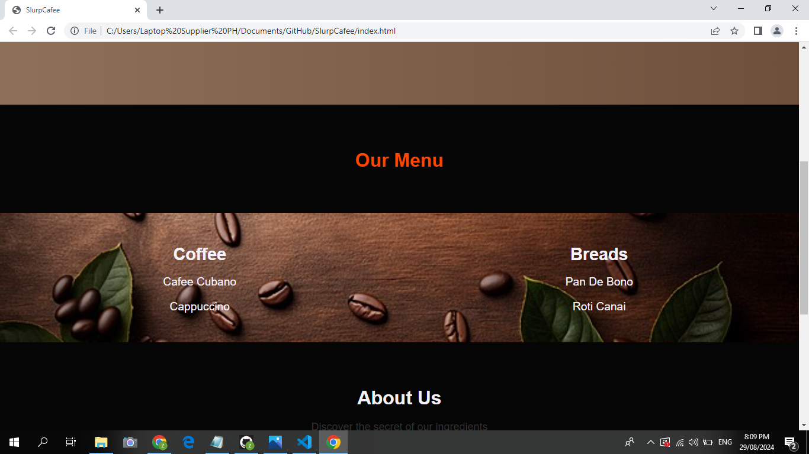
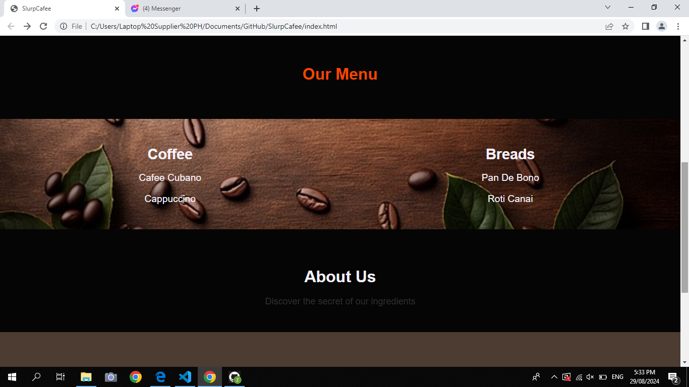
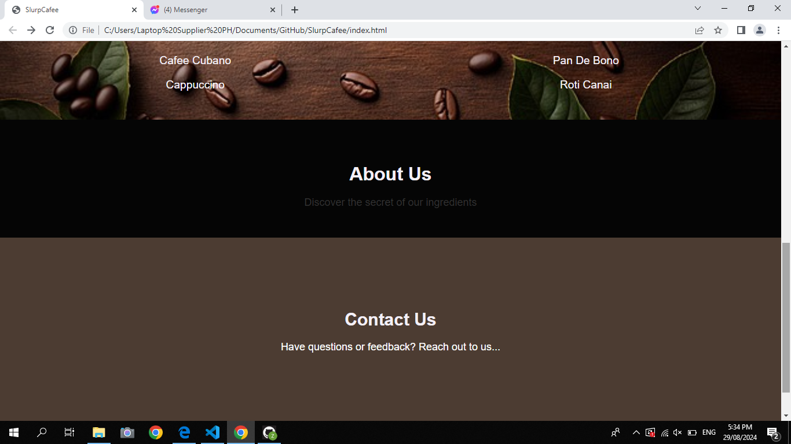
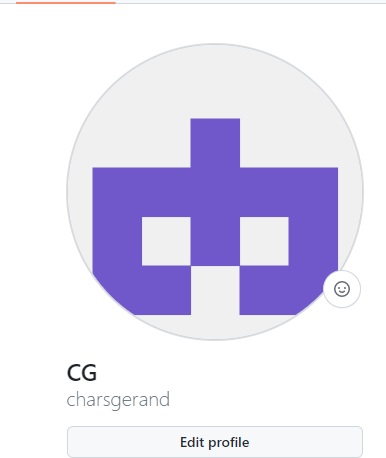
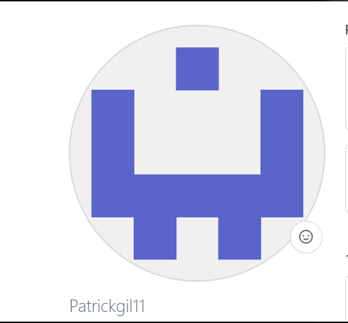

#SlurpCafee
## Project Descriptio:
SlurpCafee is  our web application designed to provide an smooth and interactive  experience  for coffee enthusiasts.
whether youre a casual coffee drinker, it also offers a variety of features to enhance your coffee journey, 
and make your day chill.

## Features
- Responsive designed for seamless browsing on any device.
- Browes a wide variety of coffee blends and types.
- Detailed product discription with customer reviews.
- Personalized recomendations based on user preferences.

## Screen Captured

Welcoming home page showcasing the features bread and coffee blends.

---

Showcasing the best bread and coffee product and also  best seller.

---

Showcasing about the story of our SlurpCafee.

---

It showcasing the email/ contact number of our Slurpcafee to reach out us.

## About the Authors

### *Chars Gerand Almocera*

** charsgerand@gmail.com**

  **Social Links**

### * Gil Patrick Sibayan *

** gpatricksibayan@gmail.com **

  **Social Links**

